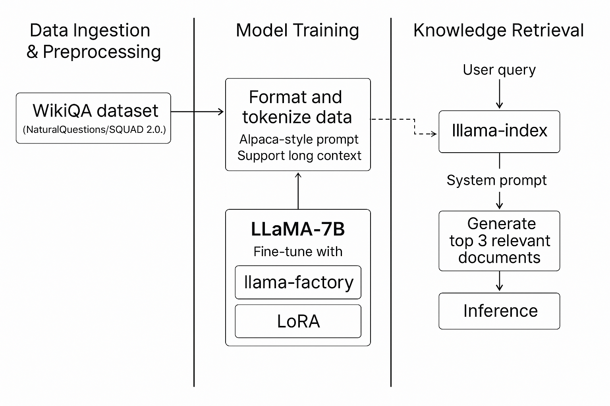
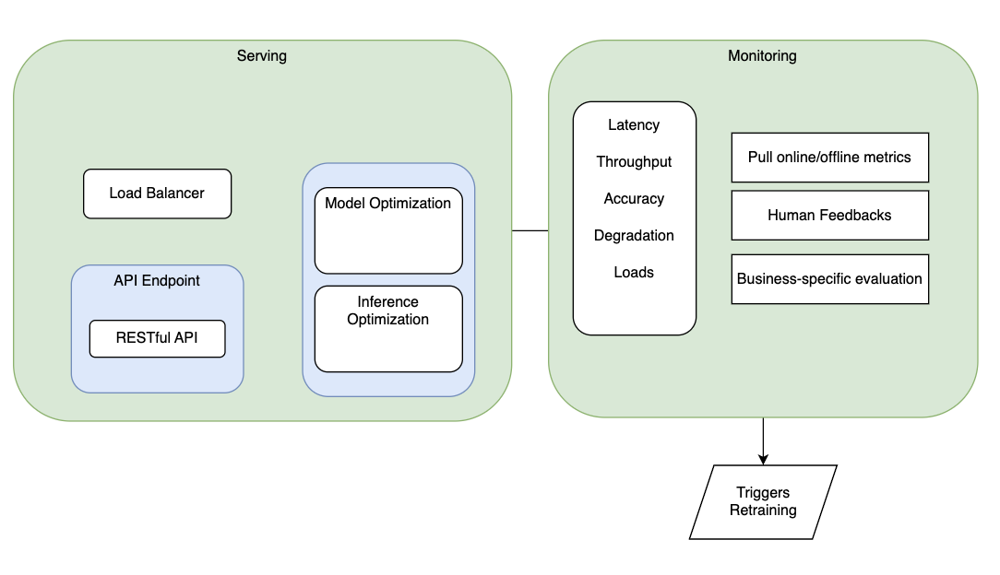
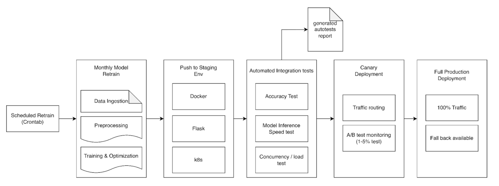

# LexiMind - Chat with your repository!

## Value Proposition

<!-- 
Discuss: Value proposition: Your will propose a machine learning system that can be used in an existing business or service. (You should not propose a system in which a new business or service would be developed around the machine learning system.) Describe the value proposition for the machine learning system. What’s the (non-ML) status quo used in the business or service? What business metric are you going to be judged on? (Note that the “service” does not have to be for general users; you can propose a system for a science problem, for example.)

LexiMind is a machine learning system that helps developers better understand both technical documentation and codebases in open-source repositories.

It combines a fine-tuned large language model with Retrieval-Augmented Generation (RAG) to deliver interactive, context-aware answers.  -->

---

## ❓ Problem

Today’s onboarding process for open-source contributors is:

- ❗ Hard to navigate large codebases
- ❗ Frustrating due to missing or outdated docs
- ❗ Confusing to map high-level designs to code
- ❗ Inefficient without linked explanations

Even when documentation exists, it may be:

- Outdated
- Incomplete
- Unlinked from actual implementation

---

## ✅ Solution: LexiMind

LexiMind is tailored for **junior developers** onboarding into open-source projects.

It helps by:

- 🔍 Linking natural language queries to relevant code or functions
- 🔗 Bridging high-level docs and low-level code
- 📚 Synthesizing knowledge from code, issues, design docs, and wikis

🎯 Result: Developers onboard faster, understand better, and contribute with confidence.

---

## 📊 Evaluation Metrics

We combine **automatic** and **human-centric** evaluations:

| Category           | Metric / Method                                                  |
|--------------------|------------------------------------------------------------------|
| Language Quality   | BLEU, ROUGE, METEOR                                              |
| Human Evaluation   | Correctness, Clarity, Informativeness                            |
| System Performance | Median response time, concurrent usage tolerance                 |
| Real-world Utility | PR submissions and acceptance rate by LexiMind-assisted devs     |

---

## 📂 Data & Licensing

LexiMind uses only **public and properly licensed resources**, including:

- Open-source code repositories
- Project wikis
- Technical documents
- Research papers (non-commercial use)

> ⚠️ Commercial use is **not allowed** unless licensing is negotiated. All sources are properly attributed.

---

### Contributors

<!-- Table of contributors and their roles. First row: define responsibilities that are shared by the team. Then each row after that is: name of contributor, their role, and in the third column you will link to their contributions. If your project involves multiple repos, you will link to their contributions in all repos here. -->

| Name                            | Responsible for | Link to their commits in this repo |
|---------------------------------|-----------------|------------------------------------|
| Tyler Li                   |        CICD         |                                    |
| Zeyuan Shen                   |       Training          |                                    |
| Mohammed Zakriah Ibrahim                   |       Data          |                                    |
| Xing Fang |    Model Serving              |                                   |

### System diagram

<!-- Overall digram of system. Doesn't need polish, does need to show all the pieces. Must include: all the hardware, all the containers/software platforms, all the models, all the data. -->


### Summary of outside materials

<!-- In a table, a row for each dataset, foundation model. Name of data/model, conditions under which it was created (ideally with links/references), conditions under which it may be used. -->

## QA Pair Dataset

| Dataset Name | Size (Records) | Link | Source | Description | Dataset Example | Notes | How It Was Created | Conditions of Use |
|-------------|----------------|------|--------|-------------|-----------------|-------|--------------------|-------------------|
| **SQuAD 2.0** | 150,000+ questions | [SQuAD 2.0](https://rajpurkar.github.io/SQuAD-explorer/) | Stanford University | Combines over 100,000 questions from SQuAD 1.1 with over 50,000 unanswerable questions written adversarially to test the model's ability to abstain from answering when no answer is available in the context. | "What is the capital of France?" with the answer "Paris" found in the given context. | Widely used benchmark for machine reading comprehension. | Questions were crowd-sourced based on Wikipedia articles; unanswerable questions were crafted to resemble answerable ones. | Available for non-commercial use under the CC BY-SA 4.0 license. |
| **Natural Questions** | 323,045 questions | [Natural Questions](https://ai.google.com/research/NaturalQuestions) | Google AI | Real anonymized, aggregated queries issued to the Google search engine, paired with corresponding Wikipedia pages containing the answer. | "What is the tallest mountain in the world?" with the answer "Mount Everest" found in the provided Wikipedia article. | Reflects real-world search queries, providing a realistic QA training set. | Questions are real user queries; answers were annotated by human raters. | Available under the CC BY-SA 3.0 license. |
| **TriviaQA** | 650,000 question-answer-evidence triples | [TriviaQA](http://nlp.cs.washington.edu/triviaqa/) | University of Washington | Contains question-answer pairs from trivia and quiz-league websites, along with evidence documents gathered via Bing and Wikipedia searches. | "Who wrote 'To Kill a Mockingbird'?" with the answer "Harper Lee" and supporting documents from search results. | Includes both web and Wikipedia subsets; useful for open-domain QA. | Questions were scraped from trivia websites; evidence documents were retrieved using search engines. | Available for research purposes; see the dataset license for details. |
| **HotpotQA** | 113,000 questions | [HotpotQA](https://hotpotqa.github.io/) | Carnegie Mellon University & Stanford University | Designed for multi-hop question answering, requiring reasoning over multiple documents to arrive at the answer. | "What is the connection between Marie Curie and the discovery of radium?" requiring information from multiple documents to answer. | Emphasizes explainability by providing supporting facts for each answer. | Questions were crowd-sourced with instructions to require multi-hop reasoning; supporting documents were provided to annotators. | Available under the CC BY-SA 4.0 license. |
| **QuAC** | 100,000 questions | [QuAC](https://quac.ai/) | University of Washington | Conversational QA dataset with dialogues between questioners and answerers based on Wikipedia articles. | Q: "Who is Marie Curie?" A: "Marie Curie was a physicist and chemist..." | Emphasizes context in conversations. | Crowdsourced dialogues on Wikipedia topics. | CC BY-SA 4.0 License. |

## Coding Pair Datasets

| Dataset Name | Size (Records) | Link | Source | Description | Dataset Example | Notes | How It Was Created | Conditions of Use |
|-------------|--------------|------|--------|-------------|----------------|-------|----------------|-----------------|
| __CodeSearchNet__ | 6 million functions | [CodeSearchNet](https://github.com/github/CodeSearchNet) | GitHub | A dataset of functions with associated documentation from open-source projects across six programming languages (Go, Java, JavaScript, PHP, Python, Ruby). | A Python function with its corresponding docstring. | Useful for code search and code summarization tasks. | Collected from public GitHub repositories; functions paired with their docstrings. | Available under the MIT License. |
| __CoNaLa (Code/Natural Language Challenge)__ | 2,879 annotated examples | [CoNaLa](https://conala-corpus.github.io/) | Carnegie Mellon University | A dataset of natural language intents and corresponding Python code snippets, focusing on how people express coding tasks in natural language. | "How to convert a list of strings to integers in Python?" with the corresponding code `list(map(int, list_of_strings))`. | Emphasizes the translation of natural language to code. | Collected from Stack Overflow posts; manually annotated to ensure quality. | Available under the CC BY-SA 4.0 license. |
| __APPS (Automated Programming Progress Standard)__ | 10,000 problems | [APPS](https://huggingface.co/datasets/codeparrot/apps) | UC Berkeley | A dataset of coding problems and solutions, designed to evaluate the problem-solving abilities of AI systems in competitive programming. | Problem statement: "Write a function to check if a number is prime." Solution: Python function implementing prime check logic. | Challenges models with diverse and complex programming tasks. | Collected from open-source competitive programming platforms; includes problems of varying difficulty. | Available under the MIT License. |

### Summary of infrastructure requirements

<!-- Itemize all your anticipated requirements: What (`m1.medium` VM, `gpu_mi100`), how much/when, justification. Include compute, floating IPs, persistent storage. The table below shows an example, it is not a recommendation. -->

| Requirement     | How many/when                                     | Justification |
|-----------------|---------------------------------------------------|---------------|
| `m1.medium` VMs | 3 for entire project duration                     | Retrieval, API server, CI/CD pipeline components and monitoring tools |
| `gpu_mi100`     | 4 hour block twice a week                         | Required for training     |
| `gpu_rtx6000`   | 1 for entire project                              | Required for quick inferencing     |
| Floating IPs    | 1 for entire project duration, 1 for extra use    | Required to expose the chatbot inference API endpoint to users   |
| Persistent Storage |   200 GB                                       | Storage for dataset, pre-trained model etc    |

# Detailed design plan

<!-- In each section, you should describe (1) your strategy, (2) the relevant parts of the diagram, (3) justification for your strategy, (4) relate back to lecture material, (5) include specific numbers. -->

## Model training and training platforms

<!-- Make sure to clarify how you will satisfy the Unit 4 and Unit 5 requirements, and which optional "difficulty" points you are attempting. -->



Due to limited training resources and the large model size (possibly 7B–70B parameters), we adopt low-resource training strategies and experiment with various parameters (e.g., LoRA alpha size, up/down matrix size, accumulation step size, precision level, etc.).

### Mixed Precision Training (FP16 + FP32)

- **Why this approach:**  
   Combines the benefits of FP16 (or BF16) and FP32 to balance efficiency and numerical stability.
- **Benefits:**

   - Key operations (e.g., gradient updates) remain in FP32 to prevent underflow/overflow.
   - Avoids accumulation of calculation errors common in low-precision training.

- **Comparison to other approaches:**

   - Compared to **FP16 training**, this method reduces numerical errors while keeping similar memory savings.
   - Compared to **LoRA**, it doesn't reduce parameter updates but enables efficient full-model training.

---

### LoRA / QLoRA

- **Why this approach:**  
   Rather than updating all model weights, LoRA introduces trainable low-rank matrices to frozen pre-trained layers.
- **Benefits:**

   - Reduced memory usage.
   - Fewer trainable parameters.

- **Drawbacks:**

   - May not achieve the same performance as full parameter training.

- **Comparison to other approaches:**

   - Compared to **full fine-tuning**, LoRA is more memory-efficient and faster but may underperform in capturing complex patterns.
   - Compared to **Gradient Accumulation**, LoRA reduces memory use at the parameter level, whereas gradient accumulation targets batch-level memory usage.

---

### Gradient Accumulation

- **Why this approach:**  
   Enables training with larger effective batch sizes without increasing per-step memory requirements.
- **Benefits:**

   - **Better convergence:** Larger batches result in more stable gradient updates.
   - **Memory-efficient:** Suitable for large model training on limited hardware.

- **Comparison to other approaches:**

   - Compared to **batch size reduction**, gradient accumulation maintains statistical benefits of large batches.
   - Compared to **low precision training**, it doesn't speed up computation but helps reduce memory consumption.

---

### Comparison of Low-Resource Training Strategies

| Strategy               | Memory Efficiency | Accuracy | Speed | Best For                        |
|------------------------|-------------------|----------|-------|---------------------------------|
| Mixed Precision        | Medium            | High     | High  | Stable full-model training      |
| LoRA / QLoRA           | High              | Medium   | High  | Efficient partial fine-tuning   |
| Gradient Accumulation  | Medium            | High     | Medium| Large batch size on low memory  |

---

## Distributed Training

To improve training speed, we plan to adopt distributed training methods if multiple GPUs are available. We will:

- Compare training performance on 1 GPU vs. multiple GPUs.
- Evaluate the impact on training time and stability.
- Experiment with:
   - **Distributed Data Parallel (DDP)**
   - **Fully Sharded Data Parallel (FSDP)**

# Model serving and monitoring platforms

## Diagram of Model Serving and Monitoring



<!-- Make sure to clarify how you will satisfy the Unit 6 and Unit 7 requirements,  and which optional "difficulty" points you are attempting. -->
## Evaluations
Moving along with the pipeline, we will use different evaluations against the model and system. 
| Evaluation       | Pass/Fail Criteria | Action for Pass | Action for Fail |
|------------------|--------------------|-----------------|-----------------|
| Standard         |                    |                 |                 |
| Business Specific|                    |                 |                 |
| Bias/Fairness    |                    |                 |                 |

## Model Serving
When serving a language model via an API endpoint, it is essential to identify key requirements such as latency, throughput, and accuracy. The serving system also needs to be tailored to the use case—whether for edge devices, internal systems, or massive-scale consumption. Therefore, model optimizations like quantization, pruning, and compiled graphs can reduce size and improve efficiency, while system optimizations such as batching, caching, and hardware acceleration ensure scalability and performance.Balancing trade-offs between accuracy, latency, and cost is critical to deploying a robust and cost-effective solution per use case.

For serving models from an API Endpoint, the api design would be focusing on its easiness for consumption, which we can consider RESTful based api framework, we should also consider endpoints for health checks and load checks. For better performance, we may also consider using queues and load balancers for scalability.
## Model Monitoring
Key metrics that the system will be focusing on are median latency, batched throughput, and accuracy. Based on these metrics, we will design user scenarios 

| Scenarios         | Demand   | Key metric                           |
|-------------------|----------|--------------------------------------|
| Standard (Baseline) | low      | Balance of latency/accuracy/throughput |
| Edge (PC)         | low      | latency                              |
| Internal Facing   | medium   | accuracy                             |
| Public Facing     | high     | throughput                           |

# Data Pipeline

This design addresses the requirements for persistent storage, offline data management and pipelines, online data management and pipelines, and online data simulation.

## 1. Persistent Storage (Chameleon)

**Technology:** Chameleon Block Storage (e.g., Cinder volumes).

### Setup:

- Provision a sufficiently large block storage volume on Chameleon.
- Attach this volume to the virtual machine(s) designated for data processing, model training, and potentially hosting the vector database/data repositories.
- Format and mount the volume (e.g., as `/mnt/persistent_data`).

### Purpose:

This mounted volume (`/mnt/persistent_data`) will serve as the central, persistent location for:

- **Raw Data:** Original downloaded datasets (QA pairs, Coding pairs), cloned open-source repositories.
- **Processed Data:** Cleaned and transformed data ready for fine-tuning (e.g., formatted JSONL/Parquet files).
- **RAG Knowledge Base:** Chunked documents/code, vector embeddings/indices, metadata mapping.
- **Model Artifacts:** Fine-tuned LLM weights, tokenizer files.
- **Evaluation Artifacts:** Test sets, reference answers, evaluation script outputs (scores).
- **Container Images:** Custom Docker images saved as tarballs (though a container registry is often preferable).
- **Logs:** Persistent logs from ETL jobs or training runs.

## 2. Offline Data Management & Pipeline (ETL for Fine-tuning & RAG)

This pipeline focuses on ingesting, processing, and storing data needed for fine-tuning the LLM and populating the RAG knowledge base.

### Data Sources:

- **QA Datasets:** SQuAD 2.0, Natural Questions, TriviaQA, HotpotQA, OpenBookQA, DROP.
- **Coding Pair Datasets:** CodeSearchNet, CoNaLa, Django Dataset, SPoC, APPS.
- **Target Open-Source Repositories:** Specific GitHub repositories containing code and documentation (README files, markdown documentation, Wikis, etc.).

### ETL Pipeline Steps:

#### **Extract (E):**

- **Download Datasets:** Write scripts (e.g., Python with `requests`, `huggingface datasets`) to download datasets.
- __Clone Repositories:__ Use `gitpython` to clone target repositories into `/mnt/persistent_data/raw/repositories/`.

#### **Transform (T):**

- **Standardize QA/Coding Data:**
   - Parse raw datasets (JSON, CSV, etc.).
   - Clean text data (normalize whitespace, handle special characters).
   - Convert into a unified format suitable for fine-tuning (e.g., JSON Lines `{"prompt": "...", "completion": "..."}`).
   - Store processed data in `/mnt/persistent_data/processed/finetuning_data/`.

- **Process Repositories for RAG:**
   - Identify relevant files (code, documentation, configuration files).
   - Extract and parse code/documentation content.
   - Chunk large documents and code files.
   - Generate embeddings using a sentence transformer model.
   - Store processed chunks & metadata in `/mnt/persistent_data/processed/rag_data/chunks/`.
   - Build vector index using FAISS, storing it in `/mnt/persistent_data/processed/rag_data/vector_index/`.

#### **Load (L):**

- Fine-tuning data is ready in `/mnt/persistent_data/processed/finetuning_data/`.
- RAG knowledge base is ready in `/mnt/persistent_data/processed/rag_data/`.
- **Orchestration:** Simple Python scripts or workflow tools like Makefiles, Luigi, or Airflow.

## 3. Online Data Management & Pipeline (Inference)

This pipeline handles incoming user queries in real-time using the fine-tuned LLM and the RAG system.

### Data Source:

- Real-time user queries arriving via the chatbot's API endpoint.

### Pipeline Steps:

1. **Receive & Pre-process Query:** Accept user input, clean text.
2. **Generate Query Embedding:** Use the same embedding model as offline processing.
3. **Retrieve Relevant Context (RAG):**
   - Query FAISS Vector Index.
   - Fetch the top-k similar chunks.
   - Retrieve text and metadata from the Chunk Store.

4. **Construct Prompt:** Format query and retrieved chunks for the LLM.
5. **LLM Inference:** Generate a response using the fine-tuned model.
6. **Post-process Response:** Clean output, optionally cite sources.
7. **Return Response:** Send the formatted answer back to the user.

```sh

```

### Data Storage (Online Access):

- The Vector Index and Chunk/Metadata Store are loaded into memory or accessed efficiently.
- The fine-tuned LLM model weights are loaded into GPU/CPU memory.

## 4. Online Data Simulation

### **Purpose:**

To generate realistic traffic for load testing the online inference pipeline and evaluating system performance (latency, concurrency).

### __Script (simulate_traffic.py):__

#### **Query Generation:**

- Use query templates like:
   - "How does the function `{func_name}` work?"
   - "Explain the `{class_name}` class in `{file_path}`."
   - "Summarize the file `{file_path}`."

- Populate templates using extracted function/class names.
- Include adversarial or out-of-scope questions for robustness.
- Adapt portions of QA datasets to codebase queries.

#### **Traffic Pattern:**

- Use `asyncio` and `aiohttp` for asynchronous request generation.
- Control request rate (e.g., 1 req/sec to 100 req/sec for testing limits).
- Simulate multiple concurrent users.
- Introduce randomness in query selection and timing.
- Run from a separate VM or container within the Chameleon environment.

### **Data Characteristics:**

- **Content:** Questions covering code understanding, API usage, module interaction.
- **Format:** Plain text strings sent via HTTP POST/GET requests.
- **Volume:** Configurable rate (e.g., 1 req/sec to 100 req/sec).
- **Variety:** Mix of targeted questions and open-ended exploratory questions.

### **Output:**

- Log response times, status codes, and response latencies for performance analysis.


<!-- Make sure to clarify how you will satisfy the Unit 8 requirements,  and which optional "difficulty" points you are attempting. -->

## Continuous X

<!-- Make sure to clarify how you will satisfy the Unit 3 requirements,  and which optional "difficulty" points you are attempting. -->



### 1. Scheduled Retraining & Automation

According to prof fund's slides we should have a trigger mechanism to do the continuous training when some specific threshold is reached.
A cron-based trigger (via Argo Workflows or Kubernetes CronJobs) initiates automated monthly model retraining
Pipeline includes data ingestion, preprocessing, model retraining, and model optimization (e.g., pruning, quantization).
Model artifacts are versioned and pushed into artifact storage (e.g., S3, MinIO).

### 2. Integration & Validation

The entire system (model + API service) is wrapped in a Docker container with Flask, orchestrated via Kubernetes (K8s).
In staging, we run automated integration tests, including:

- Inference accuracy tests
- Latency and throughput benchmarks
- Concurrency and load tests
- Auto-release tests
   Results are compiled into an automated test report (HTML/JSON format) for review.

### 3. Staged Deployment Strategy

We adopt a multi-tiered deployment to ensure stability and quality:

- Staging:
   Initial deployment for automated testing and validation.
- Canary:
   A small portion of real traffic is routed to the new version.
   Online metrics are monitored (e.g., latency, error rate, user engagement).
   If performance meets predefined SLAs, the model is eligible for promotion.
- Production:
   Full rollout across all traffic after canary validation passes.

### 4. Promotion Workflow

Promotion from staging → canary is triggered automatically on test pass and human approval (optional).
Promotion from canary → production is conditional on monitored KPIs and duration (e.g., stable for 24h).
Canary fallback is enabled if performance degradation is detected.

### 5. Infrastructure-as-Code Compliance

All infrastructure, deployment, and configuration code is written in:
Terraform (declarative IaC) or python-chi (imperative style),
Stored in Git and version-controlled,
Deployed using ArgoCD for GitOps-style reconciliation,
Avoiding any manual ClickOps or shell provisioning.

### 6. Cloud-Native Architecture

Immutable infrastructure: No manual changes; everything is defined in Git and rebuilt via CI/CD.
Microservices architecture: Each component (model training, serving, testing, metrics collection) is a separate service communicating via APIs.
Container-first: All components (training jobs, APIs, metrics tools) run in containers. No direct compute operations outside of orchestration.

## Check for difficulty points:

- Training: Training strategies for large models: If your training job does not easily fit on a low-end GPU, you will use the strategies discussed in this lesson to train your model. For your reports, you will conduct experiments and show measurements similar to those in the lab assignment, to evaluate the effect of these strategies.
- Training: Use distributed training to increase velocity: If you have a medium-sized training job, how fast can you train your model? Include a discussion (backed up by experiment results!) of total model training time with one GPU vs. multiple GPUs of the same type, using the strategy (DDP, FSDP, and appropriate batch size) that makes the most sense given the size of your model. You will include a plot of training time vs. number of GPUs for each strategy under consideration. (if we are assigned to multiple GPU)
- Production: Develop multiple options for serving: If you are using a model that benefits from using GPU for inference, you can get “extra difficulty points” by developing and evaluating optimized server-grade GPU, server-grade CPU, and on-device options for model serving, and comparing them with respect to performance and cost of deployment on a commercial cloud.
- Production: Monitor for model degradation: After your model is deployed in production, monitor for degradation in the model output (by closing the feedback loop!). Make this available to engineers (e.g in a dashboard), and trigger automatic re-training with new, labeled, production data when this occurs.

